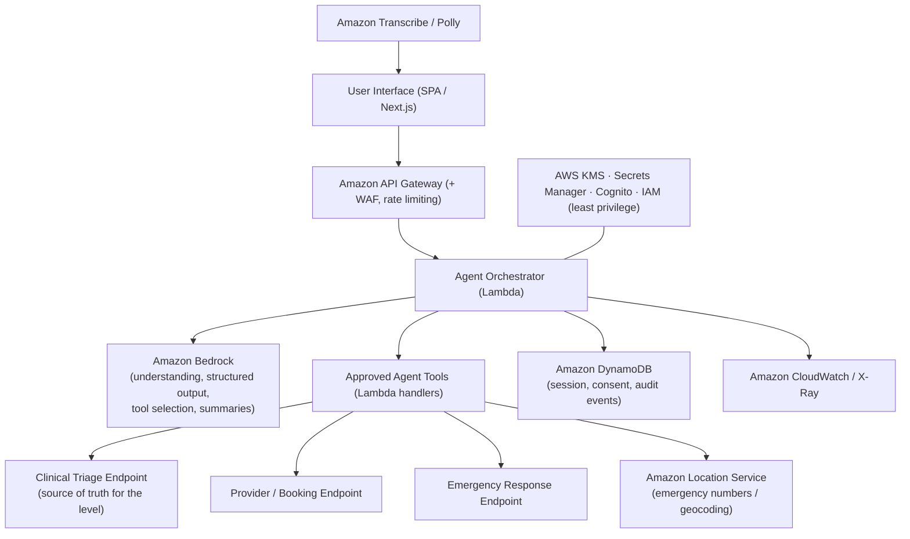

# Health Response Agent

**Clear guidance when you need to know what to do next.**

Health Response Agent is an action-oriented **AI health response agent** (not a
chatbot). It collects relevant context, detects possible emergency warning
signs, calls a clinical triage service to determine the appropriate response
level, produces a structured medical handoff, requests consent before sensitive
actions, executes permitted actions, and monitors their status.

> ⚠️ This service provides general health guidance and does **not** replace a
> qualified healthcare professional. It does not diagnose. If you believe you
> are in immediate danger, contact local emergency services now.

---

## Why this is an AI agent, not a chatbot

The conversational surface is only the interaction layer. The core product is an
agent with **reasoning, tools, memory, safety policies, state management and
auditable actions**:

- **State machine** with 15 states and a guarded transition map (invalid
  transitions are rejected). See `src/agent/state-machine.ts`.
- **Restricted tool registry** — the agent may only invoke explicitly registered
  tools. See `src/agent/tools.ts`.
- **Controlled loop** — receive input → update context → screen for emergency →
  decide if more info is needed → select an approved tool → execute → validate →
  transition → return a concise user-facing message. See
  `src/agent/orchestrator.ts`.
- **Triage is the source of truth.** The frontend/agent never compute the final
  clinical level; they always call the triage service.
- **Auditable events** for every tool call, consent change and action.

## Three response levels

| Level | Meaning | Agent behaviour |
|------|---------|-----------------|
| **1** | Immediate guidance & self-care | Conservative guidance, monitoring advice, warning signs. No diagnosis, no "you are safe". |
| **2** | Medical attention within 24 hours | Clear timeframe, structured handoff, consent-gated provider contact. |
| **3** | Urgent / emergency escalation | Interrupts the questionnaire, shows the country emergency number, requests consent, performs a **clearly-labelled simulated** escalation, and monitors status. |

## User flow

Welcome → Location & language → Main health concern → Adaptive questions →
Triage processing → Level 1/2/3 result → Structured summary & action
(copy / download / share / new assessment / update symptoms).

An **emergency shortcut** and an **emergency interruption mechanism** can jump
straight to the Level 3 flow at any point while preserving collected information.

---

## Agent tools

Registered in `src/agent/tools.ts`, each backed by a modular service:

1. `emergency_screening` — detect emergency warning signs (interrupt trigger).
2. `generate_follow_up_question` — pick the next relevant question (no repeats).
3. `submit_triage` — clinical triage (source of truth for the level).
4. `generate_clinical_summary` — factual structured handoff.
5. `get_emergency_number` — country emergency number (never invented by an LLM).
6. `request_medical_contact` — Level 2 provider contact (consent required).
7. `escalate_emergency` — Level 3 escalation (consent + idempotency required).
8. `check_escalation_status` — monitor an action by reference id.
9. `update_symptoms` — report changed symptoms → reassessment.
10. `export_summary` — downloadable/shareable summary (no internal notes).

## Architecture (current MVP)

This repository ships a **zero-dependency** implementation so the full agent
demo runs offline with no package installation:

- **Backend:** a Node built-in `http` server (`src/server`) exposing every
  `/api/*` route. Each route maps 1:1 to an AWS Lambda handler in production.
- **Services:** modular adapters (`src/services/*`) each with a shared
  interface + **mock** and **real** implementations, selected by configuration.
- **Agent:** state machine + tool registry + orchestrator (`src/agent`).
- **Shared domain:** strong TypeScript types + a dependency-free runtime schema
  validator (`src/shared/schema.ts`, a Zod substitute) used to validate every
  request/response.
- **Frontend:** a vanilla TypeScript SPA (`src/client`) — reactive store,
  screens/components, i18n (English + Arabic with RTL), demo mode, technical
  judge panel. Compiled to native ES modules; no framework/bundler required.

> The original brief targets Next.js + React + Tailwind + Zod. This sandbox
> blocks all npm/CDN installs, so those exact packages cannot be fetched. The
> code is structured with the same separation of concerns (typed API client,
> service adapters, schemas, component architecture, state store) so migrating
> to Next.js/React later is mechanical. Every place a real endpoint / Bedrock /
> AWS service should be wired is marked in code and in "Connecting real
> endpoints" below.

### AWS architecture (target)



**Bedrock** understands input, manages the conversation, extracts structured
information, selects approved tools and generates user-friendly explanations and
the factual handoff. It is **not** presented as a clinically validated triage
system — the **triage endpoint** returns the validated level, action, warning
signs, timeframe and whether escalation is required.

---

## Installation

Requires **Node.js 18+** (no other dependencies).

```bash
cp .env.example .env      # optional; sensible defaults are built in
npm run build             # compiles server + client TypeScript, copies static assets
npm start                 # serves http://localhost:3000
```

Other scripts: `npm run dev` (build + start), `npm test` (typecheck + run tests),
`npm run typecheck`.

## Environment variables

See `.env.example`. Highlights:

- `PUBLIC_DEMO_MODE` / `NEXT_PUBLIC_DEMO_MODE` — enable Demo Mode (default `true`).
- `SERVICE_MODE` — `mock` (default) forces all mock adapters; `auto` uses a real
  adapter **only** when its endpoint URL is set.
- `TRIAGE_ENDPOINT`, `EMERGENCY_SCREENING_ENDPOINT`, `MEDICAL_PROVIDER_ENDPOINT`,
  `EMERGENCY_ESCALATION_ENDPOINT` — real downstream endpoints (server-side only).
- `AWS_*`, `DYNAMODB_*`, `LOCATION_PLACE_INDEX` — server-side only.

> **Never** put AWS credentials or secrets in `PUBLIC_*` / `NEXT_PUBLIC_*`
> variables — those are exposed to the browser.

## Demo Mode

With `PUBLIC_DEMO_MODE=true`:

- The app is labelled **"Simulated demonstration"**.
- Mock adapters return schema-valid responses with ~1–2s processing delay
  (`MOCK_LATENCY_MS`).
- Three predefined scenarios are available from the welcome screen and the header
  selector:
  1. **General guidance** — mild headache → Level 1.
  2. **Review within 24 hours** — persistent abdominal pain → Level 2.
  3. **Urgent escalation** — chest pressure cluster → Level 3.
- A **Reset demo** control and a **Technical view** panel (`{ }` in the header)
  are available.
- Simulated actions are **always** labelled `SIMULATED` and never presented as
  real medical actions.

## Connecting real endpoints / replacing mocks

1. Set `SERVICE_MODE=auto`.
2. Set the relevant endpoint URL(s) in `.env`.
3. The corresponding **real adapter** (`Real*Service` in each
   `src/services/*/index.ts`) is used automatically; the rest of the app is
   unchanged. All responses are still validated against the shared schemas.
4. Endpoint **paths** live in one place: `src/shared/constants.ts` → `API_ROUTES`.
5. To wire Bedrock, implement the orchestrator's tool selection using Bedrock
   structured output; the tool registry and state machine stay the same.

## Safety & privacy

- Explicit, separate consent for **health data** and **location**, with
  timestamps; optional consent can be revoked before an action is submitted.
- No silent location collection; no diagnosis or prescription claims; no invented
  certainty, emergency number, appointment or escalation confirmation.
- Emergency interruption + safe fallbacks when triage/escalation APIs fail.
- Idempotency keys prevent duplicate escalations; **emergency actions are never
  auto-retried**.
- Sensitive fields are redacted before reaching the technical panel
  (`sanitizeForPanel`), audit metadata excludes raw health data, and the client
  never logs sensitive health data.
- Secure headers (CSP, nosniff, frame-deny), server-side validation, input
  sanitisation, session expiry via reset, and a **Clear session data** action.

## Testing

```bash
npm test
```

Covers: Level 1/2/3 triage, emergency interruption, emergency-number lookup,
consent required before escalation/provider contact, simulated labelling,
duplicate-escalation prevention, escalation status monitoring, schema
validation (valid + invalid), agent state transitions (consent gating, emergency
interrupt, no return to routine after L3), technical-panel sanitisation, and the
agent loop (emergency vs follow-up).

## Deployment

The MVP runs as a single Node process (`npm start`). For AWS: put the SPA behind
CloudFront/S3, map each `/api/*` route to a Lambda behind API Gateway (with WAF +
throttling), store session/consent/audit in DynamoDB, keep secrets in Secrets
Manager, and use Bedrock for the orchestrator's language tasks.

---

## Three-minute demo script

- **0:00–0:30 — Problem.** People with a health concern often don't know whether
  to monitor it, see a doctor soon, or get emergency help.
- **0:30–1:00 — Product.** Not a chatbot: it gathers context, selects tools,
  calls a clinical triage service, and executes the appropriate next action.
- **1:00–1:30 — Level 1.** Run the mild-headache scenario → general guidance +
  warning signs.
- **1:30–2:00 — Level 2.** Run the abdominal-pain scenario → 24-hour
  recommendation, clinical handoff, simulated provider-contact action.
- **2:00–2:40 — Level 3.** Run the chest-pressure scenario → immediate
  interruption, emergency number, consent, simulated escalation + live status.
- **2:40–3:00 — Technical panel.** Show agent state, tool calls, AWS mapping,
  audit trail and endpoint integration.

Closing line: *"Health Response Agent transforms a health concern into a clear,
safety-first next action: guidance now, medical attention within 24 hours, or
urgent escalation."*

## Known limitations & next steps

- Mock triage is a **conservative deterministic rule engine**, not a clinically
  validated system; replace with the real triage endpoint / Bedrock-assisted
  flow before any real use.
- Sessions/audit are in-memory per process — move to DynamoDB for durability.
- Voice is a **simulated** placeholder (button + interface ready for Amazon
  Transcribe/Polly).
- Authentication (Cognito) is prepared in config but not enforced in the MVP.
- Because the build sandbox blocks package installs, the UI is a hand-rolled SPA
  rather than Next.js/React/Tailwind; the architecture is designed to port
  cleanly to those.
```
