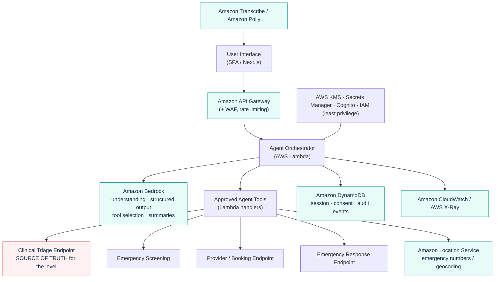
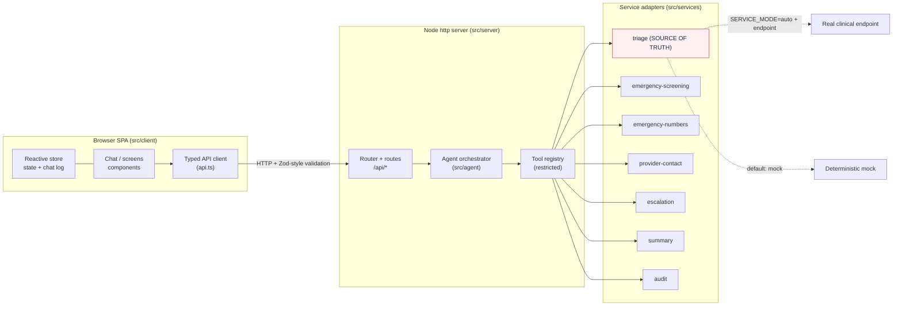
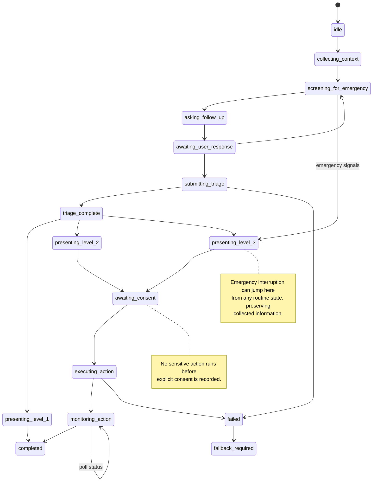
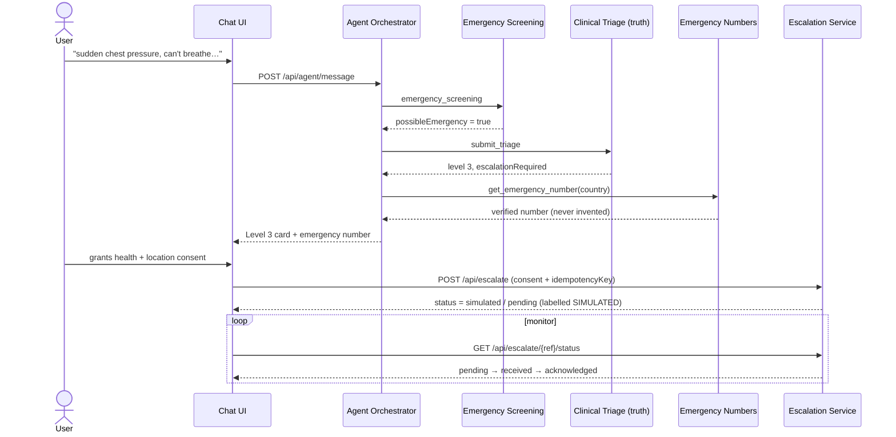

# Health Response Agent — Architecture

This document describes how the **Health Response Agent** is put together: the
target AWS architecture, the current MVP implementation, the agent state
machine, and the request / consent / escalation flow.

> The agent is **action-oriented**, not a chatbot. It maintains context, screens
> for emergencies, calls a clinical triage service (the **source of truth** for
> the response level), produces a structured handoff, requests consent before
> sensitive actions, executes permitted actions, and monitors their status.

GitHub renders the Mermaid diagrams below inline.

---

## 1. AWS architecture (target)

**Bedrock** understands input, manages the conversation, extracts structured
information, selects approved tools, and generates user-friendly explanations and
the factual handoff. It is **not** a clinically validated triage system — the
**triage endpoint** returns the validated level, recommended action, warning
signs, timeframe, and whether escalation is required.

---

## 2. Current MVP implementation

The repository ships a zero-runtime-dependency implementation that mirrors the
target architecture, so it runs offline and ports cleanly to AWS later.

Each service has a shared interface plus **mock** and **real** implementations,
selected by configuration (`SERVICE_MODE` + endpoint env vars). Every payload is
validated by a dependency-free schema validator (`src/shared/schema.ts`).

---

## 3. Agent state machine

The orchestrator only moves between a fixed set of states through a **guarded
transition map** — invalid transitions are rejected. This is what makes it a
controlled agent rather than an ad-hoc chatbot.

Key guarantees enforced by the machine:

- An action cannot execute before **consent** (`awaiting_consent → executing_action`).
- Emergency signals **interrupt** the questionnaire and route straight to Level 3.
- After a confirmed Level 3 escalation the agent does **not** silently return to
  routine questions.
- Any safety-critical failure routes to `fallback_required`.

---

## 4. Request / consent / escalation flow (Level 3)

**Safety rules in this flow:** consent is required and recorded before sharing;
the emergency number comes only from a verified source; the escalation is
idempotent (no duplicate alerts) and **never auto-retried**; simulated actions
are always labelled and never presented as real.

---

## Related

- Product overview, tools, install and demo script: [README.md](../README.md)
- Endpoint paths (single source): `src/shared/constants.ts` → `API_ROUTES`
- Agent state machine: `src/agent/state-machine.ts`
- Tool registry: `src/agent/tools.ts`
